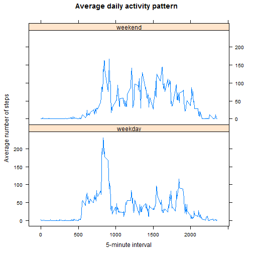

This is a report of outcome of analysis on data from a personal activity monitoring device. This device collects data at 5 minute intervals through out the day. The data consists of two months of data from an anonymous individual collected during the months of October and November, 2012 and include the number of steps taken in 5 minute intervals each day.

The variables included in this dataset are:

- steps: Number of steps taking in a 5-minute interval (missing values are coded as NA)
- date: The date on which the measurement was taken in YYYY-MM-DD format
- interval: Identifier for the 5-minute interval in which measurement was taken

The analysis was performed with the help of ***dplyr*** package. Also, the ***lattice*** package was used to plot the graphs. It is necessary to install those packages before the analysis and load them using the following R commands;

```r
library(dplyr)
library(lattice)
```

##Loading and preprocessing the data
First of all, the zip file containing the actual data file should be extracted and the activity data is loaded to R variable. Since the date values are loaded as character string, we need to convert them to the actual date format. Below is the code snippet to load and preprocess the data;   

```r
unzip("activity.zip")
activity <- read.csv("activity.csv", header = TRUE, stringsAsFactor = FALSE)
activity$date  <- as.Date(activity$date, format = "%Y-%m-%d")
```

Let us now verify if the data is loaded properly or not.

```r
str(activity)
```

```
## 'data.frame':	17568 obs. of  3 variables:
##  $ steps   : int  NA NA NA NA NA NA NA NA NA NA ...
##  $ date    : Date, format: "2012-10-01" "2012-10-01" ...
##  $ interval: int  0 5 10 15 20 25 30 35 40 45 ...
```

Everything looks good. Let's start with answering the few questions.

### What is mean total number of steps taken per day?
In order find out the mean of total number of steps per day, we first need to aggregate the data. We are ignoring any missing value at this point. Let's load the data to ***dplyr*** dataset.

```r
activity_df <- tbl_df(activity)
```

Aggregate the data and load it to the different dataset and check the output.

```r
summary_steps <- activity_df %>% group_by(date) %>% summarise(Total = sum(steps, na.rm = TRUE))
head(summary_steps)
```

```
## Source: local data frame [6 x 2]
## 
##         date Total
## 1 2012-10-01     0
## 2 2012-10-02   126
## 3 2012-10-03 11352
## 4 2012-10-04 12116
## 5 2012-10-05 13294
## 6 2012-10-06 15420
```

Looks good. The 0 value for October 1st is due to missing data. Let's draw the histogram of total number of steps taken each day.

```r
hist(summary_steps$Total, main = "Total number of steps taken per day", xlab = "Total number of steps")
```

 

Let's calculate the mean of total number of steps taken per day.

```r
mean(summary_steps$Total)
```

```
## [1] 9354
```

And the median too.

```r
median(summary_steps$Total)
```

```
## [1] 10395
```

### What is the average daily activity pattern?
We will now find out the average steps across all days. In order to achieve this, we aggregate the data based on the time interval and load them to the separate dataset. 

```r
summary_activity <- activity_df %>% group_by(interval) %>% summarise(Average = mean(steps, na.rm = TRUE))
```

We also make a time series plot of the 5-minute interval.

```r
plot(summary_activity, type = "l", xlab = "5-minute interval", ylab = "Average number of steps", main = "Average daily activity pattern")
```

 

Let's also find which 5-minute interval has the maximum number of steps.

```r
summary_activity[which(summary_activity$Average == max(summary_activity$Average)),]
```

```
## Source: local data frame [1 x 2]
## 
##     interval Average
## 104      835   206.2
```

It seems like the person is most active at around 8:35 in the morning.

### Imputing missing values
It is understood that data usually have missing values and we need to find out if our data is exception to this norm.

```r
nrow(activity[which(is.na(activity$steps)),])
```

```
## [1] 2304
```

We now need to devise a strategy for filling in all those missing values. For this, we will take dataset with the average of each 5 minutes interval (***summary_activity***) and will merge it with the original activity dataset to fill the missing values for respective interval.


```r
activity_merged <- merge(activity, summary_activity, by.x="interval", by.y="interval", all=TRUE)
activity_merged$steps[is.na(activity_merged$steps)]  <- activity_merged$Average[is.na(activity_merged$steps)]
```

Let's verify if we are able to fill in all the missing values.

```r
nrow(activity_merged[which(is.na(activity_merged$steps)),])
```

```
## [1] 0
```

Using the dplyr package, we aggregate the total number of steps taken for each day and then plot the histogram as done previously.

```r
activity_df <- tbl_df(activity_merged)
summary_steps <- activity_df %>% group_by(date) %>% summarise(Total = sum(steps, na.rm = TRUE))
hist(summary_steps$Total, main = "Total number of steps taken per day", xlab = "Total number of steps")
```

 

Again, calculate the mean and median with no missing data.

```r
mean(summary_steps$Total)
```

```
## [1] 10766
```

```r
median(summary_steps$Total)
```

```
## [1] 10766
```

## Are there differences in activity patterns between weekdays and weekends?
In order to analyse activity pattern between weekdays and weekends, we will add a new variable to our newly created dataset (***activity_merged***) to indicate whethere a date is a weekday or weekend.

```r
activity_merged$day <- as.factor(ifelse(weekdays(activity_merged$date) %in% c("Sunday", "Saturday"), "weekend", "weekday"))
```

Verify if we got the additional variable right.

```r
head(activity_merged)
```

```
##   interval steps       date Average     day
## 1        0 1.717 2012-10-01   1.717 weekday
## 2        0 0.000 2012-11-23   1.717 weekday
## 3        0 0.000 2012-10-28   1.717 weekend
## 4        0 0.000 2012-11-06   1.717 weekday
## 5        0 0.000 2012-11-24   1.717 weekend
## 6        0 0.000 2012-11-15   1.717 weekday
```

We now aggregate the steps based on interval and day of the week (weekday or weekend).

```r
activity_df <- tbl_df(activity_merged)
summary_activity <- activity_df %>% group_by(interval,day) %>% summarise(Average = mean(steps))
```

It is always a good idea to check your data.

```r
head(summary_activity)
```

```
## Source: local data frame [6 x 3]
## Groups: interval
## 
##   interval     day Average
## 1        0 weekday 2.25115
## 2        0 weekend 0.21462
## 3        5 weekday 0.44528
## 4        5 weekend 0.04245
## 5       10 weekday 0.17317
## 6       10 weekend 0.01651
```

Finally, time series plot of the 5-minute interval and average number of steps taken, averaged across all weekday or weekend days.

```r
xyplot(summary_activity$Average ~ summary_activity$interval | summary_activity$day, layout = c(1, 2), type="l", xlab = "5-minute interval", ylab = "Average number of steps", main = "Average daily activity pattern")
```

 
